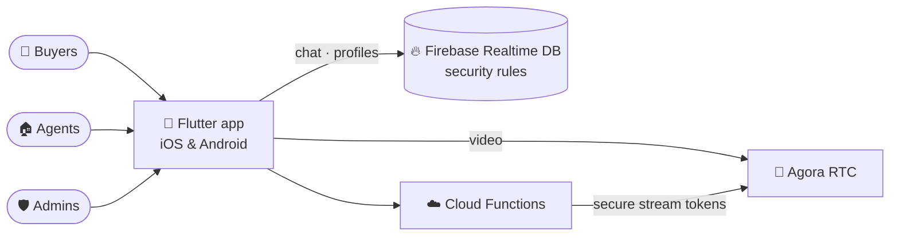
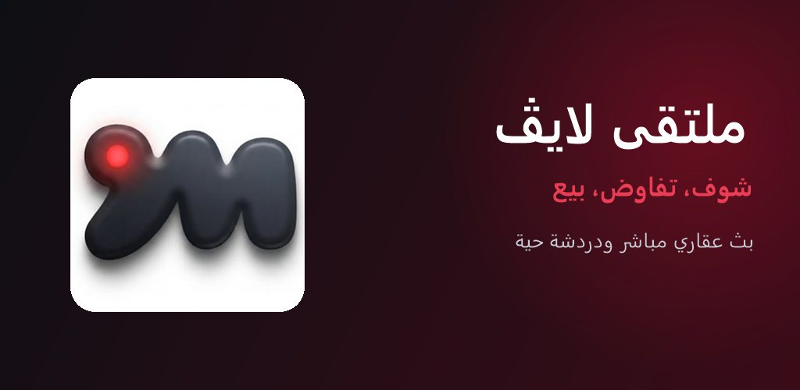
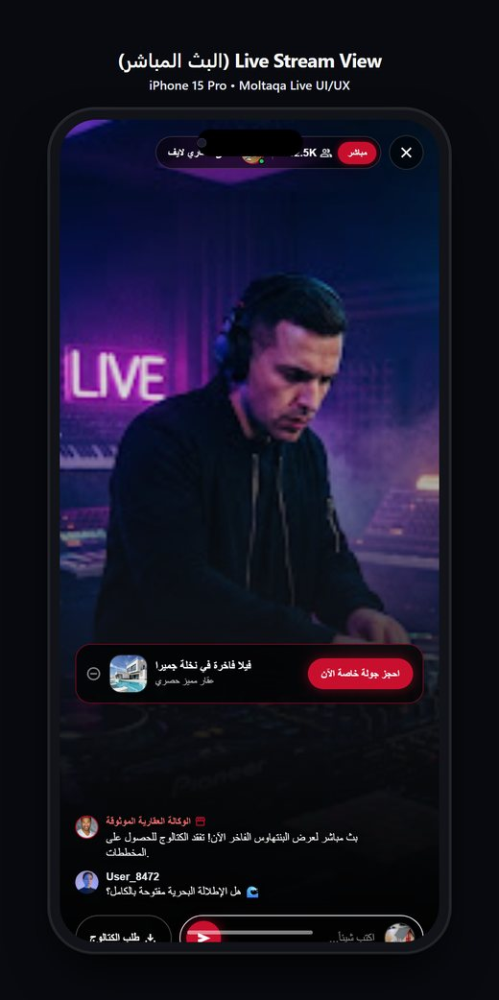
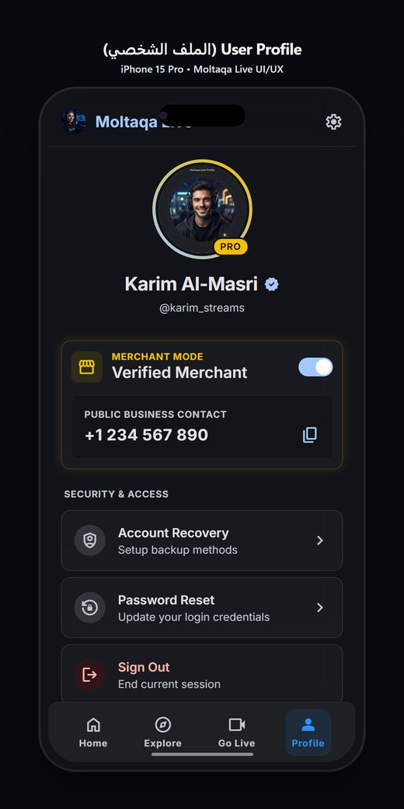
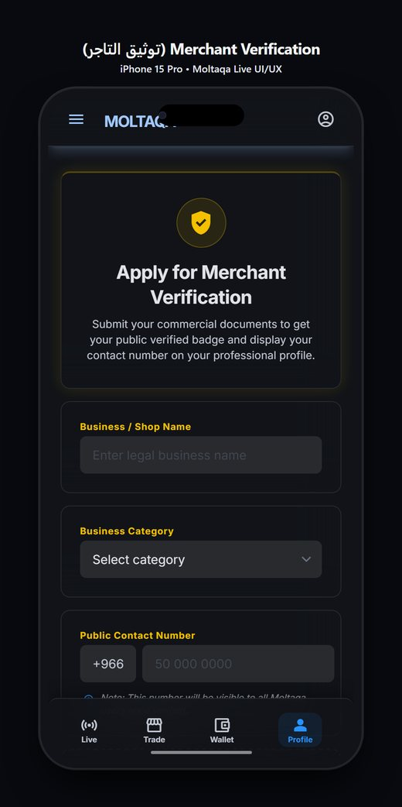
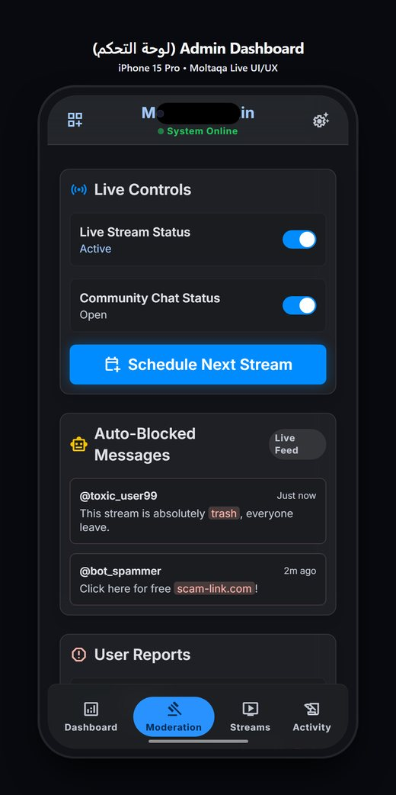

> 🔒 **The source code is private** (production / client work). This repository is a case study: what the product does, how it is built, and my role. A code walkthrough is available on request: [abdelqader.pro](https://abdelqader.pro) · [LinkedIn](https://www.linkedin.com/in/abdelqader-al-omari/).

## Overview
**Moltaqa Live** ("see it, negotiate, sell") brings real-estate viewing into live video: agents stream properties, buyers
chat in real time, request catalogs and book private tours, all in Arabic and English, on iOS and Android.

## Key features
- 📡 **Live video streaming** with viewer counts and a pinned **property card** ("book a private tour")
- 💬 **Real-time community chat** during every stream, with catalog requests
- ✅ **Verified merchants**: license / commercial-register verification reviewed by admins, so buyers know who they deal with
- 🔐 **Privacy by default**: phone numbers masked unless the user chooses to show them
- 🛡️ **Moderation dashboard**: stream and chat controls, **auto-blocked toxic / spam messages**, user reports, stream scheduling
- 🌍 **Bilingual** Arabic / English

## Architecture

## My role
Mobile and backend development: the Flutter app, Firebase data model and security rules, Cloud Functions for secure
stream tokens, moderation tooling, and store-release preparation.

## Tech
    

## Screenshots

<table><tr><td align="center" width="25%"> Live stream with property card and chat</td><td align="center" width="25%"> Profile with verified merchant mode</td><td align="center" width="25%"> Merchant license verification</td><td align="center" width="25%"> Admin moderation dashboard</td></tr></table>

---

**Built by [Abdelqader Al-Omari](https://github.com/abdelqader-alomari)** · Senior Full-Stack Engineer · AI & Enterprise Solutions

  

